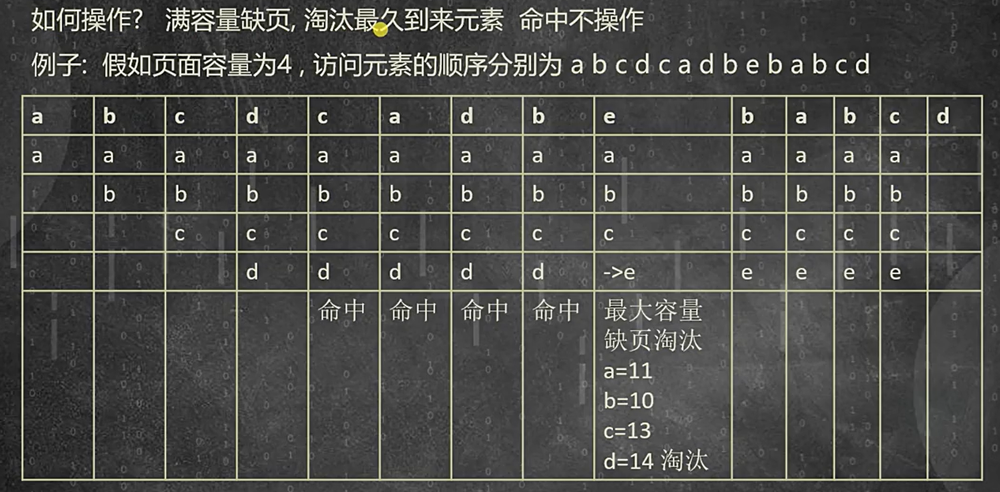
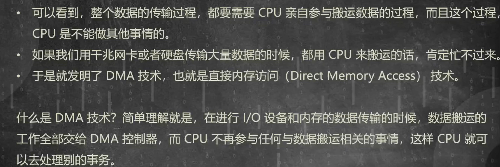
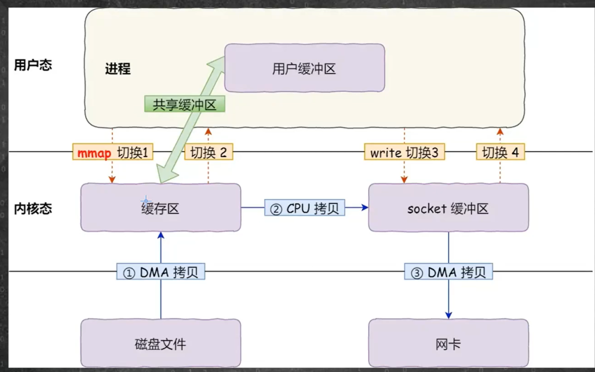
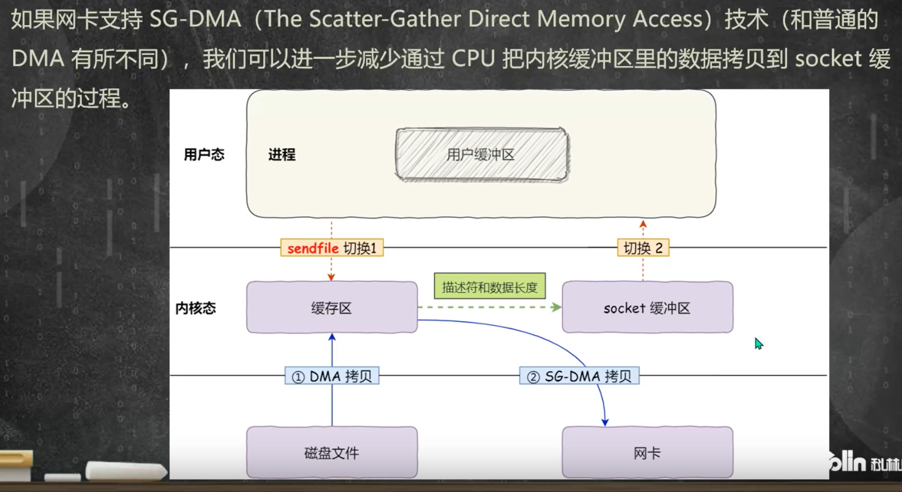
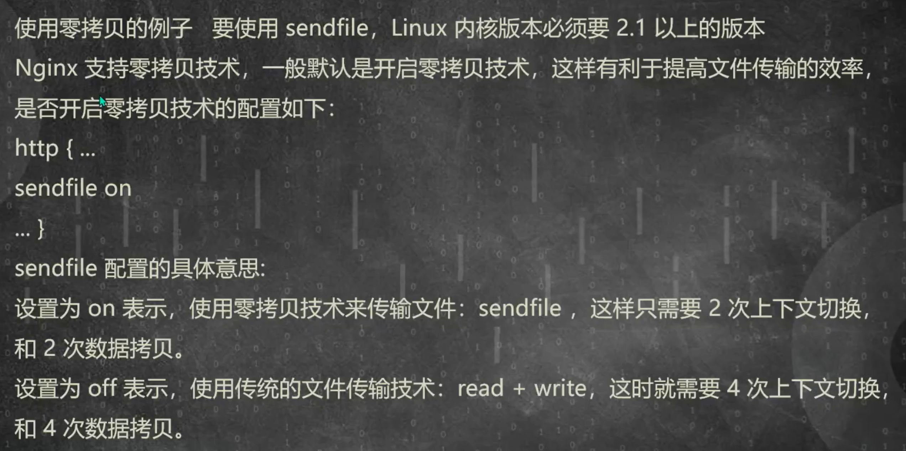
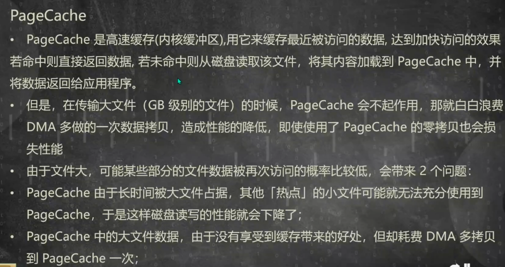

[TOC]

# 操作系统

#### 并发和并行

同一时刻发生。并行就是同时发生。两个或者多个
并发是同一时间间隔交替的进行

由于交替的时间很短，用户无法察，会有一种错觉,好像同时在运行

	

#### 什么是协程?

要了解这个先要了解一些背景知识
系统的权限ring 0, ring1, ring2, ring3
最里面的权限最高ring 0-->内核态
最外面的权限最低 ring3->用户态
内核态可以操作硬件系统函数-->磁盘里面写东西
用户态，没有权限操作内存和硬盘,切换到内核态,然后进行硬件操作,，切换会用户态
线程调度,进程调度都是内核态来完成的.
也就是说线程由运行切换到等待挂起是用户态到内核态的过程

cpu上下文切换：将cpu内的东西拷走，在拷贝其他东西过来。挂起线程/进程，加载新的。

协程（Coroutine）是一种并发编程模型，它允许程序在单线程内实现多个独立的执行线程，这些线程可以非阻塞地挂起和恢复，以实现协作式多任务处理。协程的核心思想是让程序员能够控制执行的流程，而不是完全交给操作系统或线程调度器来控制。

https://www.cnblogs.com/Survivalist/p/11527949.html

[]: https://www.cnblogs.com/Survivalist/p/11527949.html

什么是线程上下文切换?
首先，了解CPU上下文切换，执行指令,需要依靠CPU寄存器，
他主要是存储执行需要的数据以及执行程序的地址
当用户态到内核态时，涉及到旧数据和旧执行程序的地址的保存,以及新数据和新执行程序地址的保存，此为CPU上下文切换.
而当线程切换时，会涉及线程上下文切换，首先他会触发CPU上下文切换，同时会涉及旧线程数据保存，以及新线程数据的加载(保存现场和加载现场)
综上所述，当线程切换时,会导致很多数据拷贝，而耗费CPU资源

#### 为什么用协程?

一是节省CPU，协程是用户态的线程，用户可以自行控制协程的创建于销毁，
极大程度避免了系统级线程上下文切换造成的资源浪费。
二是节约内存，在协程编程模式下，可以轻松有十几万协程，这是线程无法比拟的。
三是稳定性，任何一个线程出错时，进程中的所有线程都会跟着一起崩溃。
四是开发效率，使用协程在开发程序之中，可以很方便的将一些耗时的I0操作异步化，
例如写文件、耗时10请求等。

#### 线程的并发问题?多个线程访问共享的资源，如何控制并发?

线程同步方式: 原子访问临界区事件互斥量信号量条件变量
进程的同步方式:信号量，互斥量
线程通信方式:一个进程里面 全局变量,发送消息不同进程-->进程间通信
进程通信方式:文件映射 管道 动态库节点 剪贴板 套接字(跨主机也可以)
通信 同步 同步方式也算是通信手段

对于多线程的程序来说，同步指的是在一定的时间内只允许某一个线程访问某个资源。

线程通信：全局资源，堆区，sock

消息队列

#### 生产者消费者模型?线程池的设计，怎么设计?优化?--重点问题

生产者消费者设计思路
1)定义了多个生产者和消费者。
2)生产者生产多个产品，向同步队列里面插入数据。
3)消费者监听这个队列，当队列里边有数据，从里边拉取数据。
4)如果队列满了，生产者阻塞。
5)如果队列空了，消费者阻塞。
阻塞与非阻塞的理解
线程池的任务队列设置多大?为什么使用环形缓冲区?

#### 线程池初始的线程数设置成什么合理?

理论结果 经验的结果
N核处理器通过执行业务单线程执行本地的任务计算时间x等待时间是y
工作线程数=N\*(x+y)/x
x==y(无缝衔接) -->2*N核心数的2倍
线程池优化
优化:生产者消费者模型缺点(阻塞-->队列尽量大)同步锁-->用户态<-->内核态切换
不用锁可不可以-->"无锁"编程乐观锁解决问题线程资源-->动态扩充和销毁
同步阻塞队列-->无锁队列 -->百度 cas 机制

## 内存分配管理：

### 内存管理 -- windows

#### 连续分配管理

##### 单一连续分配

- 只能用于单用户单任务操作系统。
- 作业一旦进入内存，要等待结束之后释放。
- 无法实现多个进程共享主存

##### 固定分区分配

- 将内存分成若干区不同分区可以放不同程序。
- 要先确定。运行就不能改变
- 通常采用静态重定位方式装内存。

##### 动态分区分配

- 是可变分区分配。根据作业大小动态分配创建分区

#### 非连续分配管理

进程-->虚拟内存     指令-->不同物理地址

虚拟内存-->逻辑地址，-->.内存管理单元MMU映射表 -->物理空间

##### 页式：

- 逻辑空间等分为页;并从0开始编号，页面大小4kB

- 物理内存空间分为块(不一定连续)，块大小与页大小相等;从0开始编号

- 逻辑地址结构        页号，位移量(页内地址)

- | 31---------12 | 11---------------0 |
    | ------------- | ------------------ |
    | 页号          | 位移量             |

- 地址长度为32位，0~11位为页内地址，即每页大小为4KB; 12~31位为页号,最多2^20页

- 逻辑地址 /2的12次方=页号        %2的12次方=页内地址

    - 	

- 练习:若页面大小为1字节,页号2对应的物理块是b=8计算逻辑地址A= 2500的物理地址?
    逻辑地址 2500    2500 / 1k 余数= 452         页号商=2       页号2     页内地址 452

    物理块8的起始地址 8\*1k= 8\*1024
    逻辑地址对应的物理地址从0开始偏移8\*1k + 452=8*1024 + 452=8644

- ​	缺页中断与页面置换算法
    逻辑空间→页表→物理空间
    内存管理单元MMU 存储 映射表，比如页表，空间是有限的;找不到，发生缺页中断
    缺页→缺页中断→页面置换淘汰旧页面→加载新页面
    页面置换算法 LRU(最近最少使用) FIFO(先进先出)等
- 内部碎片外部碎片
    - 区分内部碎片和外部碎片要看是否是固定的空间。页式的固定空间是4kb.
    - 内部碎片是固定空间分配给你，你没有用完。（分配给的空间有剩余）
    - 外部碎是非固定空间大小的，分配完了系统剩下的.（系统没分配出去的空间）
- 页式存储优缺点
    优点:没有外碎片，内碎片大小不超过页的大小
    缺点:整个程序要全部装入内存，要求有响应的硬件支持。

##### 段式：

将用户程序地址空间分成若干个大小不等的段，每段可以定义一组相对完整的逻辑信息。存储分配时，以段为单位，段与段在内存中可以不相邻接，也实现了离散分配。

内存空间为每个段分配一个连续的分区

逻辑地址结构		段号，位移量(段内地址)

| 31-----------16 | 15----------------0 |
| --------------- | ------------------- |
| 段号            | 位移量              |

段内地址16位即段最大大小64kB
逻辑地址 /2的16次方=段号	%2的16次方=段内地址

	

根据逻辑将空间分段能满足用户需求，不过有外部碎片没有内部碎片。

##### 段页式：

用户程序先分段，每个段内部再分页(内部原理同基本的分页、分段相同)

地址结构(逻辑地址)		段号 段内页号	页内地址

结合段式和页式的优点。内部碎片比页式更多。（每个段内都有内部碎片，加在一起可能超过页的大小）

段式和页式段页式存储的比较

1. 页式存储就是说将程序分页时，页的大小是固定的，只根据页面大小强硬的将程序切割开

2. 而分段时比较灵活，只有一段程序有了完整的意义才将这一段切割开。

3. 分页式作业的地址空间是一维的，页间的逻辑地址是连续的;

4. 而分段式作业的地址空间则是二维的，段间的逻辑地址是不连续的。

5. 在页式、段式存储管理中，为获得一条指令或数据，须两次访问内存而段页式则须三次访问内存
    页式和段式：先根据逻辑地址得到页号和位移量，根据页号去页表找到块号（一次），再根据块号和位移量得到物理地址，访问（两次）

    段页式：先去段表找到页表（一次），根据页表找到物理（两次），访问物理（三次）

### linux内存管理的

虚拟内存让每个进程可以独立使用空间地址，互不干扰，程序不再关心物理地址

每个进程都有自己的虚拟空间，而物理内存只有一个，所以当启用了大量的进程，物理内存必然会很紧张，于是操作系统会通过内存交换技术.不常使用的内存暂时存放到硬盘(换出)，在需要的时候再装载回物理内存(换入)。

早期处理器采用段式内存管理,，将内存按照段进行划分因为段式存储会导致外部内存碎片的问题,linux主要使用分页管理，但由于Intel处理器的发展，无法避免的分段管理。（分配上按照页式分配（分配4K），管理上按照段式管理）

linux虚拟空间分为用户态和内核态两部分，用户态由 栈、内存映射区、堆、bss段（未初始化的静态变量或全局变量） 、data段（初始化的静态变量或全局变量）、代码段组成

多级页表

简单的分页有什么缺陷?
因为操作系统是可以同时运行非常多的进程的，那这不就意味着页表会非常的庞大。比如32位系统100个进程的话，就需要400MB的内存来存储页表64位系统会更大，为了避免这个问题，引入了多级页表的解决方案

多级页表的实现
32位和页大小4KB的环境下，一个进程的页表需要装下100多万个「页表项」（4G的进程空间，每页4k 要有4G/4K = 1024*1024 ,每个项是一个指针4B，需要1024\*1024\*4 = 4M,100进程需要400M）
把这个100多万个「页表项」的单级页表再分页，将页表(一级页表)分为1024个页表(二级页表)，每个表(二级页表) 中包含1024个「页表项」，形成二级分页。
页表一定要覆盖全部虚拟地址空间，不分级的页表就需要有100多万硕页表项来映射，而二级分页则只需要1024个页表项
64位系统二级页表显然是不够的，是四级目录

为什么多级页表就节省空间了?
因为程序要执行就必须覆盖到所有的虚拟地址空间,那么如果只是1级页表,那么需要100万的页表项,如果使用二级页表，一级页表的1024项，就可以覆盖所有的虚拟地址空间，然后二级页表是需要的时候，才会创建.不需要则不创建，而用户的进程一般很难将所有的空间都使用到，那么有很多二级页表是不用创建的，因而节省空间，

	

多级页表的问题
多级页表虽然解决了空间上的问题，但是虚拟地址到物理地址的转换就多了几道转换的工序，这显然就降低了这俩地址转换的速度，也就是带来了时间上的开销。
把最常访问的几个页表项存储到访问速度更快的硬件，于是计算机科学家们，就在CPU芯片中，加入了一个专门存放程序最常访问的页表项的Cache,这个Cache 就是TLB (Traslation Lookaside Buffer)，通常称为页表缓存、转址旁路暖存、快表等。	

	

在 CPU芯片里面，封装了内存管理单元(Memory Management Unit)芯片，它用来完成地址转换和TLB的访问与交互。
有了TLB后，那么CPU在寻址时，会先查TLB，如果没找到，才会继续查常规的页表。TLB 的命中率其实是很高的，因为程序最常访问的页就那么几个

### LRU

LRU 最近最少使用淘汰算法-力扣#146
使用头添加尾删除的链表作为存储结构
链表存在最大缓存容量----链表的最大长度
如何操作?访问节点,淘汰节点一

访问节点

- 未命中
    - 是否达到最大容量
        - 否 头添加
        - 是 尾删除头添加
- 命中
    - 找到这个节点
        - 将该点移动到头(删除该节点，头添加该点)

淘汰节点:尾删除

	

### FIFO页面置换算法

以尾添加头删除的队列作为数据结构(可以使用链表也可以使用循环队列(数组)实现)

队列存在最大缓存容量----队列的最大容量

如何操作?添加节点访问节点删除

访问节点

- 未命中
    - 是否达到最大容量
        - 否 尾添加
        - 是 头删除尾添加
- 命中   不操作

可以使用数组来实现(循环队列)

### 最优页面置换算法(opt)

基础思路:当一个缺页中断发生时，对于保存在内存当中的每一个逻辑页面，计算在它的下一次访问之前，还需要等待多长时间，从中选择等待时间最长的那个被置换

这只题一个理想情况，在实际操作系统中无法知道需要等待多长时间.国算法很难实现可用于作为其他算法性能评价的依据

假设某一虚拟存储系统采用先进先出(FIFO) 页面淘汰算法，有一个进程在内存中占3页(开始时内存为空)当访问如下页面序列号后
1,2,3,1,2,4，2,3,5,3,4,5，会产生几次缺页() B      123,3次，4一次，5一次
A.4
B.5
C.6
D.7

某缓存系统采用LRU淘汰算法，假定缓存容量为4，并且初始为空，那么在顺序访问以下数据项的时候，
1,5,1,4,2,3,1,2出现缓存命中的次数是()最后缓存中即将准备淘汰的数据项是() A 	
A、3,4
B、4,4
C、1,2
D、3,3

### C语言的编译原理

预处理- 编译--汇编--链接

1. 预处理生成.i文件

    a.宏定义
    b.条件预编译指令#if #ifdef 
    c.头文件的包含 #include

    d.特殊符号///**/
    f.保留#pragma指令

2. 编译生成.a或.s文件(生成中间文件)

    单词-->词法解析-->语法解析-->语义解析-->优化-->目标代码生成->目标代码优化

3. 汇编生成.obj(Windows)或.o(Linux)文件(目标文件)

    汇编代码转化为机器可执行代码

    将中间代码转换的编程指令集放入.obj或.o文件(目标文件)里

4. 链接生成执行文件

    通过调用链接器链接程序运行需要的目标文件，以及所依赖的其他库文件,定位函数的实现，

    以及存储指令的位置,最后生成可执行文件 exe.链接分为静态链接和动态链接(链接库)

# 动态静态库(链接方式不同)

linux里面是：共享库和静态库

- 未定义标识符
    - 编译器不认识这个函数，解决办法：加头文件
- 无法解析的外部符号
    - 编译器找不到函数的实现，解决办法：添加依赖库
        - \#pragma comment(lib , "...........lib")

动静态库的优点是：封装起来，不让其他人看到代码实现

- 静态库
    - 原理
        - 静态库在链接期，把库文件拷贝到可执行文件中
    - 使用方法
        - 把头文件拷贝到当前项目中，在文件中包含（include）
        - 把库文件拷贝到当前项目中，在文件中添加依赖（#pragma comment() ）
    - 优点
        - 调用速度相对较快
    - 缺点
        - 浪费内存空间（多个应用程序依赖于同一个静态库的时候，多个程序运行时，会在内存中拷贝多份静态库）,exe比较大
        - 对程序的跟新，部署，发布比较麻烦，静态库修改后，需要重新编译整个可执行文件，重新安装
- 动态库
    - 原理
        - 动态库在链接期，只把索引文件拷贝到可执行文件中，在运行的时候才能调用动态库
    - 使用方法
        - 把头文件拷贝到当前项目中，在文件中包含
        - 把索引文件拷贝到当前项目中，在文件中添加依赖
        - 把动态库dll拷贝到exe同文件夹内
    - 优点
        - 节省内存空间，（多个应用程序依赖同一个动态库时，多个程序运行时，会在内存中拷贝一份动态库），exe较小
        - 更新简单，动态库修改以后，只需要重新编译动态库即可
    - 缺点
        - 调用比静态库慢，移值的时候需要同时移值可执行文件和动态库

linux设置动态库加载路径：

开共享库路径配置文件
sudo vi /etc/ld.so.conf
最后一行添加mycal路径
/home/colin/mycal
更新共享库加载路径
sudo ldconfig -v

### 乐观锁

以乐观的态度去看待并发，每次读写数据不变，不考虑冲突，在更新数据的时候，发现值改变，判定发生并发问题，此次更新失败,等待下次更新。实现的方式 CAS (比较然后交换)
例子:经典并发问题两个线程对全局变量i(初值0)分别加100次，结果的值小于200

	

### volatile 关键字可以修饰变量作用

1.运行时,保证线程工作内存(cpu寄存器)和主存(物理内存)数据的一致
当volatile修饰变量，写值会立即给主存赋值，并且每一次读取值,直接到主存读取，
并且写先于读，从而保证工作内存(缓存)和主存数据的一致

2.编译时，避免修饰的变量相关的编译优化，所导致多线程出现运行问题

	

上面的加锁可以解决

还比如：x = 10 ;x = 15 ; x = 5;//前两个直接干掉

volatile不能解决线程并发问题

### Linux常见的命令

linux基本命令
apt-get Is cd vi ifconfig mkdir touch cp rm mv cat
more less man chmod
grep tar kill 用户管理
ping
netstat ps telnet umask echo
ssh ftp

	

常考的命令
查看进程状态
ps aux显示所有用户的详细进程信息
ps aux|grep mysql显示包含MySQL的进程信息
查看负载情况
uptime显示系统的平均负载和运行时间
07:10:46 up 10 days, 2:30, 3 users, load average: 0.18,0.11,0.09（1，5，15分钟）
top
实时显示系统中运行的进程以及系统资源的使用情况
查看内存使用情况
free
显示系统的内存统计信息
top系统资源的使用情况

### 零拷贝技术

查看磁盘使用情况
df显示文件系统的磁盘空间使用情况
du显示目录或文件的磁盘空间使用情况
fdisk显示磁盘分区信息

	

dma直接内存访问

什么是零拷贝?
磁盘可以说是计算机系统最慢的硬件之一，读写速度相差内存10倍以上，
所以针对优化磁盘的技术非常的多，比如零拷贝
这些优化的目的就是为了提高系统的吞吐量，另外操作系统内核中的磁盘高速缓存区，
可以有效的减少磁盘的访问次数。

没有DMA

	

有DMA：

可以看到，整个数据的传输过程，都要需要 CPU亲自参与搬运数据的过程，而且这个过程，
CPU是不能做其他事情的。
如果我们用千兆网卡或者硬盘传输大量数据的时候，都用 CPU来搬运的话，肯定忙不过来。
于是就发明了DMA技术，也就是直接内存访问(Direct Memory Access) 技术。
什么是DMA 技术?简单理解就是，在进行1/O设备和内存的数据传输的时候，数据搬运的
工作全部交给DMA控制器，而CPU不再参与任何与数据搬运相关的事情，这样CPU 就可
以去处理别的事务。

	

用户进程调用 read方法，向操作系统发出/O请求，请求读取数据到自己的内存缓冲区中，
进程进入阻塞状态;
操作系统收到请求后，进一步将1/0请求发送DMA，然后让CPU执行其他任务;
DMA进一步将1/0请求发送给磁盘;
磁盘收到DMA的1/O请求，把数据从磁盘读取到磁盘控制器的缓冲区中，当磁盘控制器的
缓冲区被读满后，向DMA发起中断信号，告知自己缓冲区已满;
DMA收到磁盘的信号，将磁盘控制器缓冲区中的数据拷贝到内核缓冲区中，此时不占用
CPU, CPU可以执行其他任务;
当DMA读取了足够多的数据，就会发送中断信号给CPU;
CPU收到DMA的信号，知道数据已经准备好，于是将数据从内核拷贝到用户空间，系统调
用返回;

 4次切换2次拷贝

如何实现零拷贝
零拷贝技术实现的方式通常有2种:
mmap + write
sendfile
下面来分析是如何减少「上下文切换」和「数据拷贝」的次数。

结论:
通过使用 mmap()来代替read(),可以减少一次数据拷贝的过程。
这还不是最理想的零拷贝，因为仍然需要通过CPU把内核缓冲区的数据拷贝到socket缓
冲区里，而且仍然需要4次上下文切换，因为系统调用还是2次。

sendfile
#include <sys/socket.h>
ssize t sendfile(int out fd, int in fd, off t *offset, size_t count);
它可以替代前面的read() 和 write()这两个系统调用，这样就可以减少一次系统调用，也
就减少了2次上下文切换的开销。
该系统调用，可以直接把内核缓冲区里的数据拷贝到socket缓冲区里，不再拷贝到用户
态，这样就只有2次上下文切换，和3次数据拷贝。

这时要考虑文件块和文件信息以及包大小的发送

上面的例子是所谓的零拷贝(Zero-copy) 技术，因为我们没有在内存层面去拷贝数据，
也就是说全程没有通过CPU来搬运数据，所有的数据都是通过DMA来进行传输的。。
只需要2次上下文切换和数据拷贝次数，就可以完成文件的传输，而且2次的数据拷贝
过程，都不需要通过CPU，2次都是由 DMA来搬运。
总体来看，零拷贝技术可以把文件传输的性能提高至少一倍以上

使用零拷贝的例子要使用 sendfile, Linux 内核版本必须要2.1以上的版本
Nginx 支持零拷贝技术，一般默认是开启零拷贝技术，这样有利于提高文件传输的效率，
是否开启零拷贝技术的配置如下:
http{
sendfile on
...}
sendfile 配置的具体意思:
设置为on表示，使用零拷贝技术来传输文件:sendfile，这样只需要2次上下文切换，
和2次数据拷贝。
设置为off 表示，使用传统的文件传输技术: read + write，这时就需要4次上下文切换
和4次数据拷贝。

PageCache
PageCache是高速缓存(内核缓冲区),用它来缓存最近被访问的数据，达到加快访问的效果
若命中则直接返回数据,若未命中则从磁盘读取该文件，将其内容加载到 PageCache 中，并
将数据返回给应用程序。
但是，在传输大文件 (GB级别的文件)的时候，PageCache 会不起作用，那就白白浪费
DMA多做的一次数据拷贝，造成性能的降低，即使使用了 PageCache的零拷贝也会损
失性能
由于文件大，可能某些部分的文件数据被再次访问的概率比较低，会带来2个问题:
PageCache 由于长时间被大文件占据，其他「热点」的小文件可能就无法充分使用到
PageCache，于是这样磁盘读写的性能就会下降了;
PageCache 中的大文件数据，由于没有享受到缓存带来的好处，但却耗费 DMA 多拷贝
到 PageCache一次;

绕开 PageCache的I/O 叫直接1/O，使用 PageCache的I/O则叫缓存I/O
大文件不适合缓存I0，更适合直接IO
在高并发的场景下，针对大文件的传输的方式，应该使用「异步1/O+直接1/O」
来替代零拷贝技术。传输小文件的时候，则使用「零拷贝技术」
在 nginx中，我们可以用如下配置，来根据文件的大小来使用不同的方式

location /video/
[
sendfile on;
//开启零拷贝
aio on;
//开启异步I0
directio 1024m; //开启直接IO
}

### 进程调度

进程调度问题
什么时候发生进程调度?进程切换也是内核态完成
1)时间片耗尽,时间片轮转
2)进程等待资源被挂起，切换到其他进程

3) Sleep 主动挂起
4) 当有更高优先级进程到来时,保证优先级高的先执行
关于优先级更高的进程到来时分为两种情况。可剥夺不可剥夺
